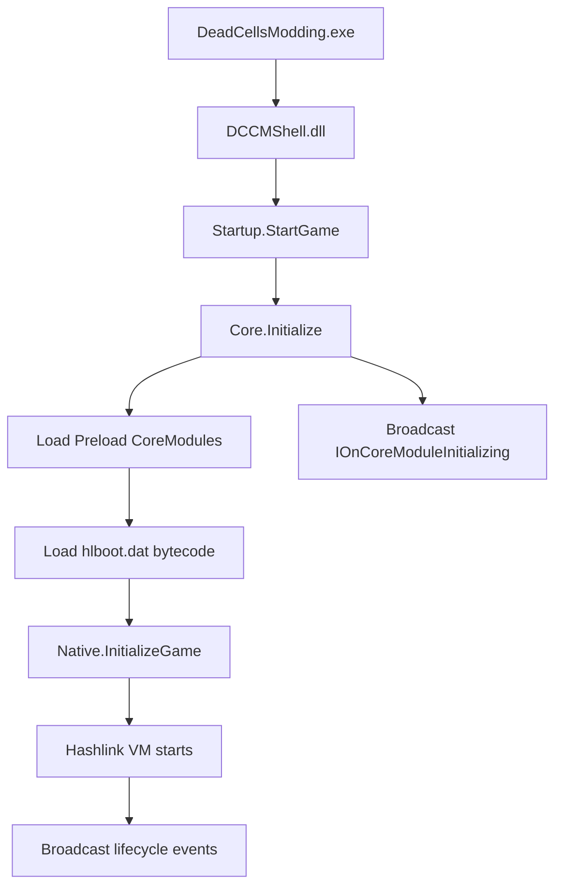

# Architecture Overview

Dead Cells Core Modding (DCCM) is a mod-loading framework for *Dead Cells*. It intercepts the game's Hashlink virtual machine (the Haxe runtime) and injects .NET managed code, enabling mods written in C# to interact with the game at runtime.

## Startup Flow



The entry point is `DeadCellsModding.exe`, a NativeAOT-compiled launcher. It locates the .NET runtime via `nethost` and loads `DCCMShell.dll`, which calls `Startup.StartGame()` to enter framework initialization.

`Core.Initialize()` is the core of framework initialization and performs the following steps in order:

1. Registers assembly resolution hooks (`AssemblyResolve`, `TypeResolve`), allowing the framework to dynamically load assemblies from the `coremod/plugins/` and `coremod/mods/` directories.
2. Initializes the native runtime (`InitializeNative`), recording runtime version and platform information.
3. Loads all core modules marked with `CoreModuleKind.Preload`, which set up essential infrastructure (e.g. storage system, hook manager) before the game starts.
4. Broadcasts the `IOnCoreModuleInitializing` event, notifying all registered receivers that core modules are ready.

After that, the framework loads `hlboot.dat` (precompiled game bootstrap bytecode) and calls `Native.InitializeGame()` to start the Hashlink VM. Once the game window is created, the framework broadcasts lifecycle events in sequence: `IOnBeforeGameInit`, `IOnGameInit`, and so on.

## Dual-Layer Module System

DCCM uses a two-layer module architecture, unifying all extensible units as subclasses of `Module`.

### Class Hierarchy

```text
Module (abstract base class, implements IEventReceiver)
  └── Module<TModule> (generic singleton base class, provides Instance property)
        └── CoreModule<TModule> (core module base class, framework-internal only)
  └── ModBase (user mod base class, receives ModInfo metadata)
```

`Module` is the root base class for all modules. Its constructor automatically calls `EventSystem.AddReceiver(this)`, registering itself with the event bus. `Module<TModule>` is the generic version, providing a static `Instance` property for singleton access.

### Core Modules (CoreModule)

Core modules are built-in framework services, annotated with the `[CoreModule]` attribute:

```csharp
[CoreModule(CoreModuleKind.Preload)] // or Normal
internal class StorageModule : CoreModule<StorageModule>, IOnCoreModuleInitializing
{
    public override int Priority => ModulePriorities.Storage;
    // ...
}
```

Key characteristics of core modules:

- **Load timing**: divided into `Preload` (loaded before the game starts) and `Normal` (loaded after the game starts). `Core.Initialize()` scans the assembly via reflection for all types with the `[CoreModule]` attribute and instantiates them.
- **Platform filtering**: `[CoreModule]` supports a `SupportOS` parameter to filter loading by Windows / Linux / Android.
- **Priority ordering**: loaded in order controlled by the `Priority` property, with reference values defined in `ModulePriorities` (smaller values execute first). For example, `Storage = -1200` ensures the storage system is ready first, while `ModLoader = -50` loads after most infrastructure.
- **Scope**: core module constructors are `internal`; external mods cannot directly inherit from `CoreModule<TModule>`.

### User Mods (ModBase)

User-written mods inherit from `ModBase` and are discovered and loaded by `ModLoader` from the `coremod/mods/` directory:

```csharp
public class MyMod(ModInfo info) : ModBase(info), IOnGameInit
{
    public override void Initialize()
    {
        Logger.Information("Mod loaded");
    }

    void IOnGameInit.OnGameInit() { /* executed after game init */ }
}
```

Mods declare metadata (name, version, type, dependencies) via `modinfo.json`. `ModLoader` reads this file, constructs a `ModInfo` object, and passes it to the `ModBase` constructor.

Core differences between the two module types:

| | CoreModule | ModBase |
| --- | --- | --- |
| Purpose | Framework built-in services | Third-party mods |
| Discovery | `[CoreModule]` attribute + reflection scan | `modinfo.json` + ModLoader |
| Load timing | Preload or Normal | After game starts |
| Inheritance constraint | Framework-internal only | Public for mod authors |
| Singleton access | `Module<T>.Instance` | Managed by ModLoader |

## Event Bus

DCCM uses an interface-based publish/subscribe pattern for inter-module communication.

### Core Mechanism

All modules participate in the event system by implementing the `IEventReceiver` interface. The `Module` base class constructor automatically calls `EventSystem.AddReceiver(this)`, so any module is registered upon instantiation with no manual steps required.

Event broadcasting is done via `EventSystem.BroadcastEvent<TInterface>()`. The framework scans all receivers implementing `TInterface`, sorts them by `Priority`, and invokes them in order:

```csharp
// Broadcast an event (framework internal)
EventSystem.BroadcastEvent<IOnGameInit>();

// Event with callback
EventSystem.BroadcastEvent<ISomeEvent, ISomeEvent.Callback>((receiver, callback) =>
{
    // Execute callback for each receiver
});
```

### Lifecycle Event Interfaces

The framework defines a rich set of lifecycle event interfaces, located in the `ModCore/Events/Interfaces/` directory. Commonly used interfaces include:

| Interface | Trigger |
| --- | --- |
| `IOnCoreModuleInitializing` | After Preload modules finish loading |
| `IOnBeforeGameInit` | Before the Haxe game entry point executes |
| `IOnGameInit` | After the game window is created |
| `IOnFrameUpdate` | Every frame |
| `IOnGameExit` | When the game exits |
| `IOnSaveConfig` | When configuration is saved |

Modules simply implement the corresponding interface to automatically receive event callbacks, with no manual subscribe or unsubscribe needed. The event system is the sole communication channel between DCCM modules, ensuring loose coupling and predictable execution order.

## Directory Structure

The core directories of the DCCM repository are as follows:

```text
DeadCellsCoreModding/
├── sources/          # Main C# solution
│   ├── ModCore/              # Core mod framework
│   ├── ModCore.Common/       # Shared utilities (EventSystem, etc.)
│   ├── ModCore.Game/         # Game integration layer
│   ├── ModCore.Native/       # Native interop (P/Invoke, TCC JIT)
│   ├── DCCMShell/            # Bootstrap bridge DLL
│   ├── DeadCellsModding/     # NativeAOT launcher
│   └── HashlinkSharp/        # C# wrapper for Hashlink VM
├── mdk/              # Mod development toolkit (MSBuild targets, proxy assemblies)
├── sample/           # Sample mods (SimpleMod, SampleWeapon, etc.)
├── test/             # Integration tests (xUnit v3, requires Hashlink VM)
├── hlboots/          # Precompiled game bootstrap bytecode
└── build/            # NUKE build automation
```

Internal structure of `sources/ModCore/`:

| Directory | Contents |
| --- | --- |
| `Events/Interfaces/` | Lifecycle event interface definitions |
| `Modules/` | Core module implementations (Game, ModLoader, HashlinkHooks, etc.) |
| `Hooks/` | Hashlink function hook manager |
| `Mods/` | ModBase, ModInfo, and other mod infrastructure |
| `Storage/` | Config, SaveData, and other persistence utilities |
