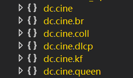
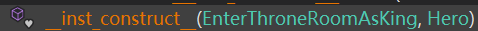
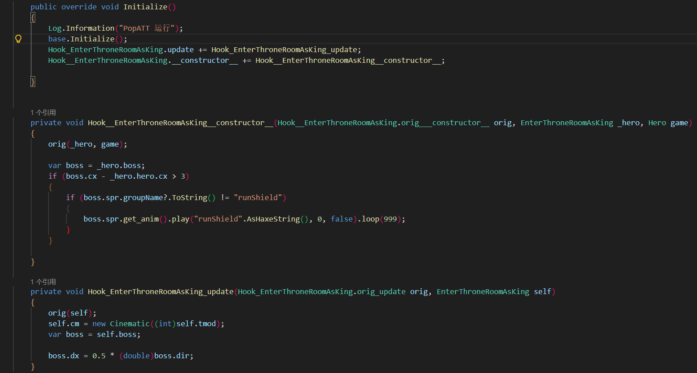
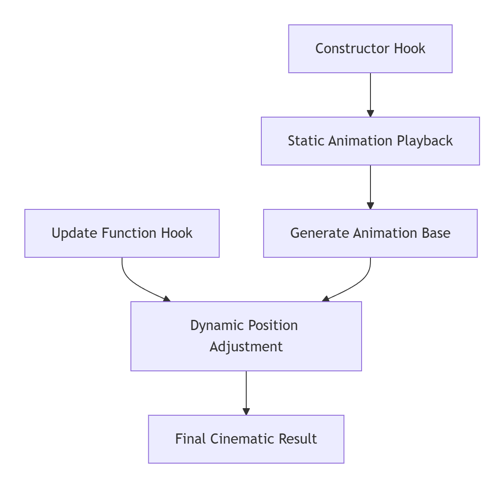

# Modifying In-Game Cutscenes
This tutorial will guide you through rewriting in-game cutscenes and understanding the cutscene logic in Dead Cells.
:::tip
I expect you to have:
- Basic C# programming skills
- Basic Dead Cells modding knowledge ([tutorial](https://www.bilibili.com/opus/681293864647000128))
:::

---
# Step One: Locate the cutscene you wish to modify
All in-game cutscenes reside within the `cine` folder



---
# Step 2: Analyse the code
### Using the example of Wang Shou meeting the King
First, examine the main class of the function


We observe that the boss's movement can be modified within the update method


## Inspecting the static class
This is the actual animation playback class – don't be intimidated by the multitude of methods


We need only focus on this static method, which forms the core of animation playback:



---
# Step Three: Writing the Code
## Hook Implementation
Add the following two Hooks within the `Initialize()` method:
The first targets the main class's update method
```csharp
Hook_EnterThroneRoomAsKing.update += Hook_EnterThroneRoomAsKing__update;//Dynamic class
```
The second targets the static method of the static class
```csharp
Hook__EnterThroneRoomAsKing.__constructor__ += Hook__EnterThroneRoomAsKing__constructor__;//Static class
```

## Overriding Original Animation
`self.cm = new Cinematic((int)self.tmod);` overrides the original static function's animation logic
```csharp
    private void Hook_EnterThroneRoomAsKing_update(Hook_EnterThroneRoomAsKing.orig_update orig, EnterThroneRoomAsKing self)

    {
        orig(self); // Invoke original logic

        self.cm = new Cinematic((int)self.tmod);// Override the original animation logic
}
private void Hook__EnterThroneRoomAsKing__constructor__(Hook__EnterThroneRoomAsKing.orig___constructor__ orig, EnterThroneRoomAsKing _hero, Hero game)

    {
    orig(_hero, game); // Invokes original logic, but bypasses original animation
    }
```
This completes the removal of the original animation.
You may now:
1. Play the corresponding animation in static classes
2. Modify boss and hero behaviour in dynamic classes
---

# Simple Example

### Wang Shou flees upon seeing the King

```csharp
private void Hook_EnterThroneRoomAsKing_constructor_(Hook_EnterThroneRoomAsKing_orig_constructor_ orig, EnterThroneRoomAsKing _hero, Hero game)
{
    orig(_hero, game); // Safely invoke the original constructor
    // Since we dynamically override new logic, we can safely call orig
    var boss = _hero.boss;
    if (boss.cx - _hero.hero.cx > 3) // Check distance from hero
    {
    if (boss.spr.groupName?.ToString() != "runShield")
        // Play the "runShield" animation statically and loop 999 times
        boss.spr.get_m().play("runShield".AsHaxeString(), 0, false).loop(999); 
    }
    // Example: Play the animation statically. Make the King run.
}

private void Hook_EnterThroneRoomAsKing_update(Hook_EnterThroneRoomAsKing_orig_update orig, EnterThroneRoomAsKing self)
{
    orig(self); // Call the original update function
    
    self.cm = new Cinematic((int)self.tmod); // Initialise cinematic controller
    var boss = self.boss;
    boss.dx = 0.5 * (double)boss.dir; // Set movement speed based on direction
}
```


:::warning
> **A new Cinematic instance must be created** > If a new `Cinematic` object is not explicitly created, the game engine will execute the default original cutscene logic.
:::
# This is how it looks when running

<iframe src="//player.bilibili.com/player.html?isOutside=true&aid=115627398269311&bvid=BV1iCSEBzEQn&cid=34337590920&p=1" scrolling="no" border="0" frameborder="no" framespacing="0" allowfullscreen="true"></iframe>


## Final Code


---



## Dynamic and Static Method Collaboration Mechanism


### Static Methods (Static)

- **Execution Timing**: Executed once during initialisation phase
    
- **Primary Function**: Play Sprite animations, set initial states
    
- **Example**: `boss.spr.get_m().play()` - Retrieve and play corresponding animation
    


### Dynamic Methods (Dynamic)

- **Execution Timing**: Executed during each frame update.
    
- **Primary Function**: Modify attributes such as position and velocity in real-time.
    
- **Example**: `boss.dx = 0.5 * boss.dir` - Controls movement speed. `Moves towards the boss's facing direction at 0.5 speed`. This automatically triggers the walking animation.

### Collaborative Relationship


---

This separation of dynamic and static elements ensures both stable animation performance and flexible logical control.

