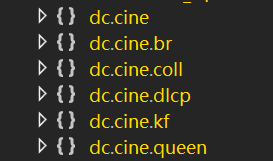
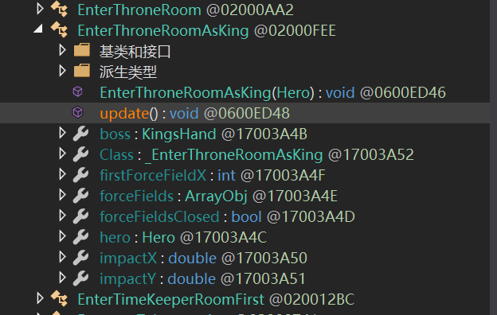
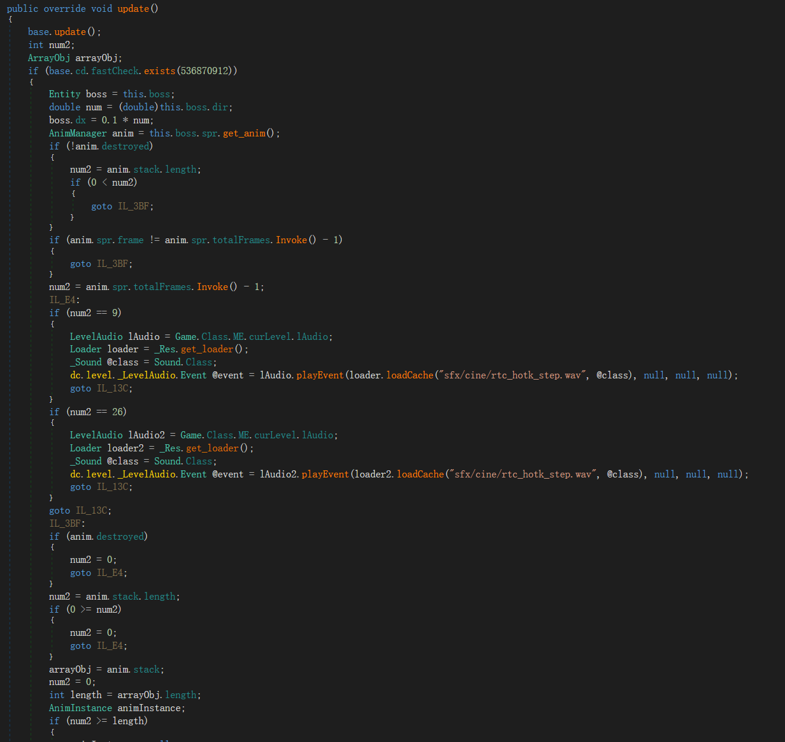
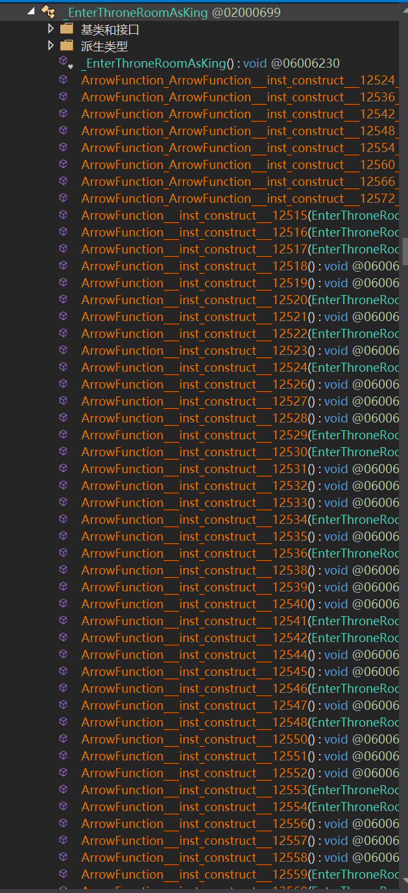
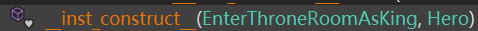
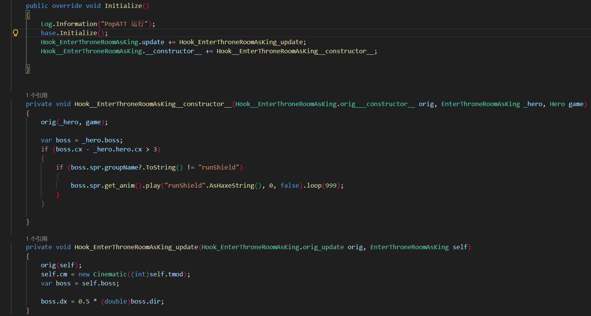
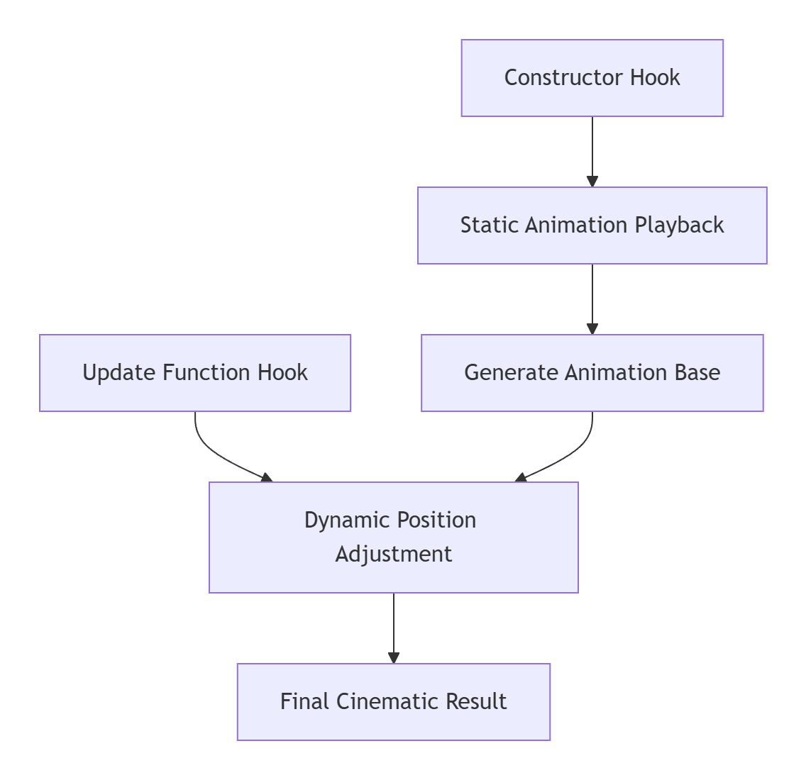

# Modifying In-Game Cutscenes
This tutorial will guide you through overriding in-game cutscenes and understanding Dead Cells' cutscene logic.
:::tip
You should have:
- Basic C# programming knowledge
- Foundational Dead Cells mod creation ([tutorial](https://www.bilibili.com/opus/681293864647000128))
:::

---

# Step 1: Find the Cutscene You Want to Modify
The `cine` folder contains all in-game cutscenes.


---

# Step 2: Analyze the Code
### Example: Hand of the King Meeting the King
First, examine the main class of the function.



We can see that the boss's movement can be modified in `update`.


## Examine the Static Class
This is the class that actually plays the cutscene. Don't be intimidated by all the methods.


Focus on this static method, it's the core of cutscene playback:



---

# Step 3: Write the Code
## Hooking
Add the following two hooks in the `Initialize()` method:
The first hooks the main class's `update` method
```csharp
Hook_EnterThroneRoomAsKing.update += Hook_EnterThroneRoomAsKing_update; // dynamic class
```
The second hooks the static class's static method
```csharp
Hook__EnterThroneRoomAsKing.__constructor__ += Hook__EnterThroneRoomAsKing__constructor__; // static class
```

## Overriding the Original Cutscene
`self.cm = new Cinematic((int)self.tmod);` overrides the original static function's cutscene logic.
```csharp
    private void Hook_EnterThroneRoomAsKing_update(Hook_EnterThroneRoomAsKing.orig_update orig, EnterThroneRoomAsKing self)

    {
        orig(self); // call original logic

        self.cm = new Cinematic((int)self.tmod); // override original cutscene logic
    }
    private void Hook__EnterThroneRoomAsKing__constructor__(Hook__EnterThroneRoomAsKing.orig___constructor__ orig, EnterThroneRoomAsKing _hero, Hero game)

    {
        orig(_hero, game); // call original logic, but won't call the original cutscene
        
    }
```
This removes the original cutscene.
From here you can:
1. Play the appropriate cutscene in the static class
2. Modify boss and hero behavior in the dynamic class

---

# Simple Example

### Hand of the King Flees Upon Seeing the King

```csharp
private void Hook_EnterThroneRoomAsKing_constructor_(Hook_EnterThroneRoomAsKing_orig_constructor_ orig, EnterThroneRoomAsKing _hero, Hero game)
{
    orig(_hero, game); // safely call the original constructor
    // Since we override with new logic in the dynamic class, we can safely call orig

    var boss = _hero.boss;
    if (boss.cx - _hero.hero.cx > 3) // check distance from the hero
    {
        if (boss.spr.groupName?.ToString() != "runShield")
            // statically play the "shield run" animation and loop 999 times
            boss.spr.get_m().play("runShield".AsHaxeString(), 0, false).loop(999); 
    }
    // Example: playing an animation in the static class. Makes the Hand of the King run.
}

private void Hook_EnterThroneRoomAsKing_update(Hook_EnterThroneRoomAsKing_orig_update orig, EnterThroneRoomAsKing self)
{
    orig(self); // call the original update function
    
    self.cm = new Cinematic((int)self.tmod); // initialize the cutscene controller
    var boss = self.boss;
    boss.dx = 0.5 * (double)boss.dir; // set movement speed based on direction
}
```


:::warning
 **You must create a new Cinematic instance** — if you don't explicitly create a new `Cinematic` object, the game engine will execute the default original cutscene logic.
:::
# Here's What It Looks Like

<iframe src="//player.bilibili.com/player.html?isOutside=true&aid=115627398269311&bvid=BV1iCSEBzEQn&cid=34337590920&p=1" scrolling="no" border="0" frameborder="no" framespacing="0" allowfullscreen="true"></iframe>


## Final Code

---


## How Static and Dynamic Methods Collaborate

### Static Methods

- **Execution timing**: Executed once during the initialization phase
    
- **Primary role**: Play sprite animations and set initial state
    
- **Example**: `boss.spr.get_m().play()` — gets and plays the corresponding animation
    

### Dynamic Methods

- **Execution timing**: Executed every frame during update
    
- **Primary role**: Modify position, speed, and other properties in real time
    
- **Example**: `boss.dx = 0.5 * boss.dir` — controls movement speed, moving at 0.5 speed in the direction the boss is facing; the walking animation plays automatically.

### Collaboration


---

Through this static-dynamic separation design, both animation stability and logic control flexibility are achieved.
