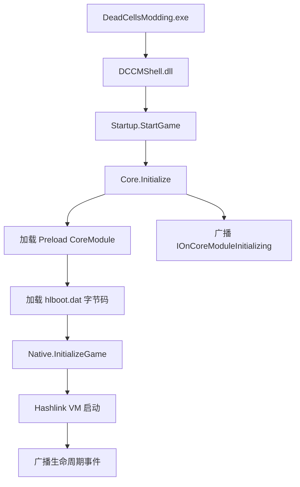

# 架构概述

Dead Cells Core Modding（以下简称 DCCM）是《Dead Cells》的模组加载框架。它拦截游戏的 Hashlink 虚拟机（Haxe 运行时），注入 .NET 托管代码，使 C# 编写的模组能够在运行时与游戏交互。

## 启动流程



启动入口是 `DeadCellsModding.exe`，一个基于 NativeAOT 编译的启动器。它通过 `nethost` 定位 .NET 运行时后加载 `DCCMShell.dll`，后者调用 `Startup.StartGame()` 进入框架初始化。

`Core.Initialize()` 是框架初始化的核心，依次完成：

1. 注册程序集解析钩子（`AssemblyResolve`、`TypeResolve`），使框架能从 `coremod/plugins/` 和 `coremod/mods/` 目录动态加载程序集。
2. 初始化原生运行时（`InitializeNative`），记录运行时版本、平台信息。
3. 加载所有标记为 `CoreModuleKind.Preload` 的核心模块，这些模块在游戏启动前完成必要的基础设施准备（如存储系统、Hook 管理器）。
4. 广播 `IOnCoreModuleInitializing` 事件，通知所有已注册接收者核心模块已就绪。

之后，框架加载 `hlboot.dat`（预编译的游戏引导字节码），调用 `Native.InitializeGame()` 启动 Hashlink 虚拟机。游戏窗口创建后，框架依次广播 `IOnBeforeGameInit`、`IOnGameInit` 等生命周期事件。

## 双层模块系统

DCCM 采用两层模块架构，将所有可扩展单元统一为 `Module` 的子类。

### 类层次结构

```text
Module (抽象基类, 实现 IEventReceiver)
  └── Module<TModule> (泛型单例基类, 提供 Instance 属性)
        └── CoreModule<TModule> (核心模块基类, 仅限框架内部)
  └── ModBase (用户模组基类, 接收 ModInfo 元数据)
```

`Module` 是所有模块的根基类。它的构造函数自动调用 `EventSystem.AddReceiver(this)`，将自身注册到事件总线。`Module<TModule>` 是泛型版本，提供静态 `Instance` 属性用于单例访问。

### 核心模块（CoreModule）

核心模块是框架内置的基础服务，使用 `[CoreModule]` 特性标注：

```csharp
[CoreModule(CoreModuleKind.Preload)] // 或 Normal
internal class StorageModule : CoreModule<StorageModule>, IOnCoreModuleInitializing
{
    public override int Priority => ModulePriorities.Storage;
    // ...
}
```

核心模块的关键特征：

- **加载时机**：分为 `Preload`（游戏启动前加载）和 `Normal`（游戏启动后加载）。`Core.Initialize()` 通过反射扫描程序集中所有带 `[CoreModule]` 特性的类型并实例化。
- **平台过滤**：`[CoreModule]` 支持 `SupportOS` 参数，可按 Windows / Linux / Android 筛选加载。
- **优先级排序**：通过 `Priority` 属性控制加载顺序，参考值定义在 `ModulePriorities` 中（数值越小越先执行）。例如 `Storage = -1200` 确保存储系统最先就绪，`ModLoader = -50` 在大多数基础设施之后加载。
- **作用域**：核心模块的构造函数为 `internal`，外部模组无法直接继承 `CoreModule<TModule>`。

### 用户模组（ModBase）

用户编写的模组继承 `ModBase`，由 `ModLoader` 从 `coremod/mods/` 目录发现和加载：

```csharp
public class MyMod(ModInfo info) : ModBase(info), IOnGameInit
{
    public override void Initialize()
    {
        Logger.Information("模组已加载");
    }

    void IOnGameInit.OnGameInit() { /* 游戏初始化后执行 */ }
}
```

模组通过 `modinfo.json` 声明元数据（名称、版本、类型、依赖），`ModLoader` 读取该文件后构建 `ModInfo` 对象并传入 `ModBase` 构造函数。

两类模块的核心区别：

| | CoreModule | ModBase |
| --- | --- | --- |
| 用途 | 框架内置服务 | 第三方模组 |
| 发现方式 | `[CoreModule]` 特性 + 反射扫描 | `modinfo.json` + ModLoader |
| 加载时机 | Preload 或 Normal | 游戏启动后 |
| 继承约束 | 仅框架内部可用 | 公开给模组作者 |
| 单例访问 | `Module<T>.Instance` | 由 ModLoader 管理 |

## 事件总线

DCCM 使用基于接口的发布/订阅模式实现模块间通信。

### 核心机制

所有模块通过实现 `IEventReceiver` 接口参与事件系统。`Module` 基类的构造函数中自动调用 `EventSystem.AddReceiver(this)`，因此任何模块在实例化时即完成注册，无需手动操作。

事件广播通过 `EventSystem.BroadcastEvent<TInterface>()` 进行，框架扫描所有实现 `TInterface` 的接收者并按 `Priority` 排序后依次调用：

```csharp
// 广播事件（框架内部）
EventSystem.BroadcastEvent<IOnGameInit>();

// 带回调的事件
EventSystem.BroadcastEvent<ISomeEvent, ISomeEvent.Callback>((receiver, callback) =>
{
    // 对每个接收者执行回调
});
```

### 生命周期事件接口

框架定义了丰富的生命周期事件接口，位于 `ModCore/Events/Interfaces/` 目录下。常用接口包括：

| 接口 | 触发时机 |
| --- | --- |
| `IOnCoreModuleInitializing` | Preload 模块加载完成后 |
| `IOnBeforeGameInit` | 游戏 Haxe 入口执行前 |
| `IOnGameInit` | 游戏窗口创建后 |
| `IOnFrameUpdate` | 每帧 |
| `IOnGameExit` | 游戏退出时 |
| `IOnSaveConfig` | 配置保存时 |

模块只需实现对应接口即可自动接收事件回调，无需手动订阅或取消订阅。事件系统是 DCCM 模块间唯一的通信渠道，确保松耦合和可预测的执行顺序。

## 目录结构

DCCM 仓库的核心目录如下：

```text
DeadCellsCoreModding/
├── sources/          # 主 C# 解决方案
│   ├── ModCore/              # 核心模组框架
│   ├── ModCore.Common/       # 共享工具（EventSystem 等）
│   ├── ModCore.Game/         # 游戏集成层
│   ├── ModCore.Native/       # 原生互操作（P/Invoke、TCC JIT）
│   ├── DCCMShell/            # 启动桥接 DLL
│   ├── DeadCellsModding/     # NativeAOT 启动器
│   └── HashlinkSharp/        # Hashlink VM 的 C# 封装
├── mdk/              # 模组开发工具链（MSBuild 目标、代理程序集）
├── sample/           # 示例模组（SimpleMod、SampleWeapon 等）
├── test/             # 集成测试（xUnit v3，需 Hashlink VM）
├── hlboots/          # 预编译游戏引导字节码
└── build/            # NUKE 构建自动化
```

`sources/ModCore/` 的内部结构：

| 目录 | 内容 |
| --- | --- |
| `Events/Interfaces/` | 生命周期事件接口定义 |
| `Modules/` | 核心模块实现（Game、ModLoader、HashlinkHooks 等） |
| `Hooks/` | Hashlink 函数 Hook 管理器 |
| `Mods/` | ModBase、ModInfo 等模组基础设施 |
| `Storage/` | Config、SaveData 等持久化工具 |
