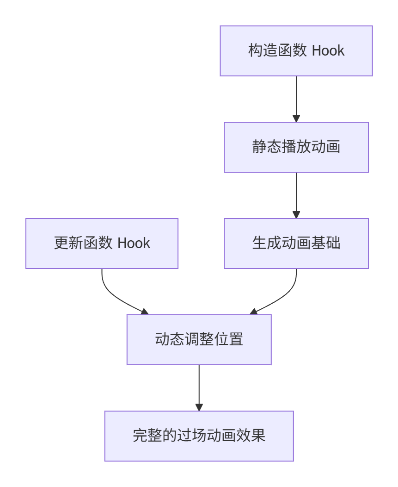

# 过场动画 Hook 逻辑介绍

## 概述

本文档介绍了用于控制角色进入王座房间过场动画的两个核心 Hook 方法。要通过静态和动态两种方式协同工作，实现角色动画的播放与逻辑控制。

我将用王守见到国王的过场动画做示例。
首先我们需要去查看 `dc.cine` 类，它控制着所有过场动画。
如果我们要重写整个方法就要同时挂钩两个或多个方法，协同完成过场动画。

```csharp
Hook_EnterThroneRoomAsKing.update += Hook_EnterThroneRoomAsKing_update; //动态类
Hook__EnterThroneRoomAsKing.__constructor__ += Hook__EnterThroneRoomAsKing__constructor__; //静态类
```


---

## 代码结构

### 1. 构造函数 Hook (`Hook_EnterThroneRoomAsKing_constructor_`)

**功能**：在过场动画对象初始化时执行，主要负责**静态播放**角色动画。

```csharp
private void Hook_EnterThroneRoomAsKing_constructor_(Hook_EnterThroneRoomAsKing_orig_constructor_ orig, EnterThroneRoomAsKing _hero, Hero game)
{
    orig(_hero, game); // 安全调用原始构造函数
    // 因为我们在动态覆盖了新的逻辑，我们就能安全调用orig

    var boss = _hero.boss;
    if (boss.cx - _hero.hero.cx > 3) // 判断与英雄的距离
    {
        if (boss.spr.groupName?.ToString() != "runShield")
            // 静态播放“持盾奔跑”动画并循环999次
            boss.spr.get_m().play("runShield".AsHaxeString(), 0, false).loop(999); 
    }
    // 示例：在静态播放动画。让王守跑起来
}
```

**关键逻辑**：

- **距离判断**：检查 Boss 与英雄角色的水平距离是否大于 3
    
- **动画切换**：如果 Boss 当前未处于 `runShield` 状态，则播放持盾奔跑动画
    
- **循环播放**：设置动画循环 999 次，确保动画持续进行
    

### 2. 更新函数 Hook (`Hook_EnterThroneRoomAsKing_update`)

**功能**：在每帧更新时执行，主要负责**动态修改**角色属性。

```csharp
private void Hook_EnterThroneRoomAsKing_update(Hook_EnterThroneRoomAsKing_orig_update orig, EnterThroneRoomAsKing self)
{
    orig(self); // 调用原始更新函数
    
    self.cm = new Cinematic((int)self.tmod); // 初始化过场动画控制器
    var boss = self.boss;
    boss.dx = 0.5 * (double)boss.dir; // 根据方向设置移动速度
}
```

**关键逻辑**：

- **​ Cinematic 控制**：创建新的过场动画控制器

:::warning
 **必须创建新的 Cinematic 实例** > 如果不显式创建新的 `Cinematic` 对象，游戏引擎将执行默认的原版过场动画逻辑。
:::
---
# 运行后就是这样的

<iframe src="//player.bilibili.com/player.html?isOutside=true&aid=115627398269311&bvid=BV1iCSEBzEQn&cid=34337590920&p=1" scrolling="no" border="0" frameborder="no" framespacing="0" allowfullscreen="true"></iframe>

---


## 动静态方法协作机制

### 静态方法 (Static)

- **执行时机**：初始化阶段一次性执行
    
- **主要作用**：播放 Sprite 动画、设置初始状态
    
- **示例**：`boss.spr.get_m().play()`- 获取并播放相应动画
    

### 动态方法 (Dynamic)

- **执行时机**：每帧更新时执行
    
- **主要作用**：实时修改位置、速度等属性
    
- **示例**：`boss.dx = 0.5 * boss.dir`- 控制移动速度`以0.5的速度，向boss朝向的位置移动`这里会自动播放行走的动画

### 协作关系



1. **静态方法奠定基础**：在初始化时设置好要播放的动画
    
2. **动态方法实时调整**：在游戏运行过程中不断更新物体状态
    
3. **两者协同工作**：静态动画提供视觉表现，动态逻辑提供行为控制
    

---

### 动画控制技巧

- **状态检查**：在播放动画前检查当前状态，避免重复播放
    
- **距离触发**：根据角色距离条件性地触发动画
    
- **帧同步**：确保动画播放与位置更新同步进行
    

---

通过这种动静态分离的设计，既保证了动画表现的稳定性，又实现了逻辑控制的灵活性。
