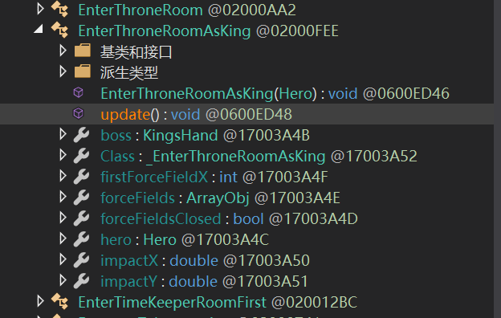
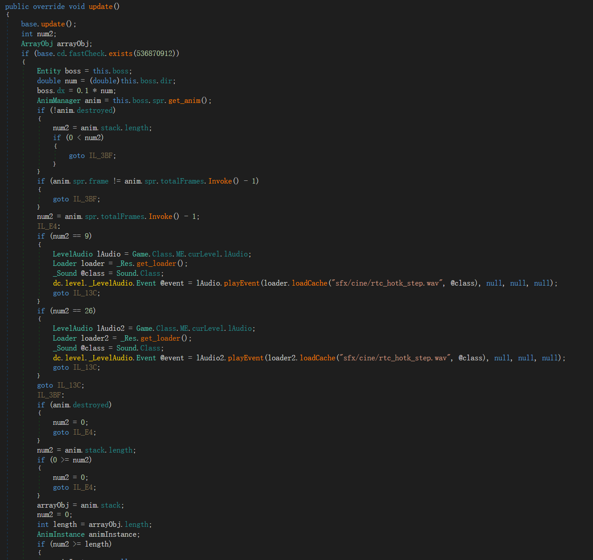
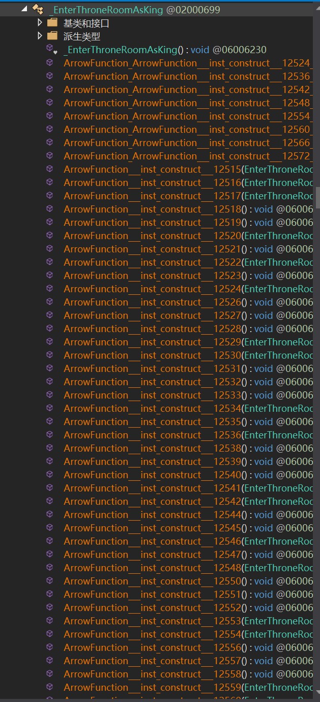

# 修改游戏中的过场动画
本教程将指导你重写游戏内的过场动画，了解死亡细胞的过场动画逻辑。
:::tip
我希望您有：
- C# 编程基础
- Dead Cells 基础 Mod 制作 ([教程](https://www.bilibili.com/opus/681293864647000128))
:::

---
# 第一步：找到您想修改的过场动画
cine里的就是游戏内的所有过场动画


---
# 第二步：分析代码
### 以王守见到国王为例
先查看函数的主类



我们发现，可以在update修改boss的移动


## 查看静态类
这里才是播放动画的类，不要被这么多方法吓到


我们只需要重点关注这个静态方法，它是动画播放的核心：


---
# 第三步：编写代码
## 挂钩hook
在 `Initialize()` 方法中添加以下两个 Hook：
第一个为主类的update方法
```csharp
Hook_EnterThroneRoomAsKing.update += Hook_EnterThroneRoomAsKing_update;//动态类
```
第二个为静态类的静态方法
```csharp
Hook__EnterThroneRoomAsKing.__constructor__ += Hook__EnterThroneRoomAsKing__constructor__;//静态类
```

## 覆盖原版动画
`self.cm = new Cinematic((int)self.tmod);`就能将原版静态函数的动画逻辑进行覆盖
```csharp
    private void Hook_EnterThroneRoomAsKing_update(Hook_EnterThroneRoomAsKing.orig_update orig, EnterThroneRoomAsKing self)

    {
        orig(self); //调用原版逻辑

        self.cm = new Cinematic((int)self.tmod);//覆盖原版动画逻辑
    }
    private void Hook__EnterThroneRoomAsKing__constructor__(Hook__EnterThroneRoomAsKing.orig___constructor__ orig, EnterThroneRoomAsKing _hero, Hero game)

    {
        orig(_hero, game);//调用原版逻辑，但不会调用原版动画
        
    }
```
这样就完成了对原版动画的删除
接下来你就可以在
1.静态类播放相应的动画
2.在动态类修改boss和hero的行为

---

# 简单示例

### 王守见到国王直接逃走

```csharp
private void Hook_EnterThroneRoomAsKing_constructor_(Hook_EnterThroneRoomAsKing_orig_constructor_ orig, EnterThroneRoomAsKing _hero, Hero game)
{
    orig(_hero, game); // 安全调用原始构造函数
    // 因为我们在动态覆盖了新的逻辑，我们就能安全调用orig

    var boss = _hero.boss;
    if (boss.cx - _hero.hero.cx > 3) // 判断与英雄的距离
    {
        if (boss.spr.groupName?.ToString() != "runShield")
            // 静态播放“持盾奔跑”动画并循环999次
            boss.spr.get_m().play("runShield".AsHaxeString(), 0, false).loop(999); 
    }
    // 示例：在静态播放动画。让王守跑起来
}

private void Hook_EnterThroneRoomAsKing_update(Hook_EnterThroneRoomAsKing_orig_update orig, EnterThroneRoomAsKing self)
{
    orig(self); // 调用原始更新函数
    
    self.cm = new Cinematic((int)self.tmod); // 初始化过场动画控制器
    var boss = self.boss;
    boss.dx = 0.5 * (double)boss.dir; // 根据方向设置移动速度
}
```


:::warning
 **必须创建新的 Cinematic 实例** > 如果不显式创建新的 `Cinematic` 对象，游戏引擎将执行默认的原版过场动画逻辑。
:::
# 运行后就是这样的

<iframe src="//player.bilibili.com/player.html?isOutside=true&aid=115627398269311&bvid=BV1iCSEBzEQn&cid=34337590920&p=1" scrolling="no" border="0" frameborder="no" framespacing="0" allowfullscreen="true"></iframe>


## 最终代码

---


## 动静态方法协作机制

### 静态方法 (Static)

- **执行时机**：初始化阶段一次性执行
    
- **主要作用**：播放 Sprite 动画、设置初始状态
    
- **示例**：`boss.spr.get_m().play()`- 获取并播放相应动画
    

### 动态方法 (Dynamic)

- **执行时机**：每帧更新时执行
    
- **主要作用**：实时修改位置、速度等属性
    
- **示例**：`boss.dx = 0.5 * boss.dir`- 控制移动速度`以0.5的速度，向boss朝向的位置移动`这里会自动播放行走的动画

### 协作关系


---

通过这种动静态分离的设计，既保证了动画表现的稳定性，又实现了逻辑控制的灵活性。
