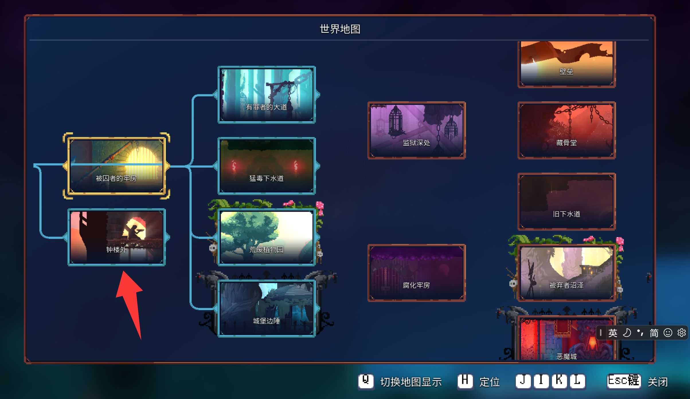
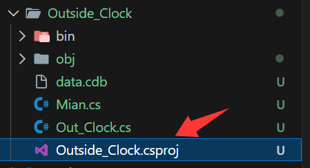

# 第一章：关卡结构

:::info
### 添加新关卡预计三个章节
- 第一章 构造关卡结构
- 第二章 构造地图环境
- 第三章 随机结构
:::
:::tip
### 本章希望你有以下基础：
1.修改 `data.cdb`.

2.`script` 模组基础.


- 如果你了解过 `script` 模组,本章会对你比较简单.
- `core modding` 提供了比 `script` 更多的修改权限.

:::
:::warning
#### 需要最新的 `core modding` 框架
因为框架发布不久,目前只有寥寥几人在研究此框架模组,希望你可以做更多的测试并完善此教程.
:::

## 一.准备工作
### 1.创建 `dccm` 模组
[点击查看教程](i18n/zh/docusaurus-plugin-content-docs/current/dev/tutorial/first-mod.md)
```csharp
using ModCore.Events.Interfaces.Game;
using ModCore.Mods;
namespace Outside_Clock
{
    public class Mian : ModBase,
        IOnGameExit
    {
        public Mian(ModInfo info) : base(info)
        {
        }
        
        public override void Initialize()
        {
            Logger.Information("你好，世界");
        }

        void IOnGameExit.OnGameExit()

        {
            Logger.Information("游戏正在退出");
        }

    }

}
```


### 2.创建一个新类

```csharp
using System;
namespace Outside_Clock;

public class Out_Clock
{

}
```
:::warning 
 这里的类名： `Out_Clock` 将会是你的关卡`id`
:::  

### 3.`data.cdb` 配置
拆包一个全新的 `data.cdb` 文件放到你的项目根目录


#### 3.1 在 `cdb` 的 `level` 一栏创建一个新关卡.

:::warning

 创建的关卡 `id` 为你在新建类的类名.
 
 添加关卡后需要添加一个hook
 ``` csharp
 Hook_LevelLogos.getLevelLogo += Hook_LevelLogos_getLevelLogo;
 
 private Tile Hook_LevelLogos_getLevelLogo(Hook_LevelLogos.orig_getLevelLogo orig, LevelLogos self, dc.String levelLogoCoordinate)
        {
            if (!self.textureCoordinateByLevelKind.exists.Invoke(levelLogoCoordinate))
            {
                return orig(self, "ClockTower".AsHaxeString());
            }
            else return orig(self, levelLogoCoordinate);
        }
 ```
 就是在世界地图添加你的关卡：（~~我太懒了~~目前还没研究，先用钟楼代替）
 
 否则会报错！
:::

:::info
因为我要创建没有外墙的室外环境，所以勾选了 `Outside`.

我们在代码里也可以设置这些选项(下面会讲到)，前提是你在 `cdb` 打开了它.

另外为了教学，先不添加怪物和物品.

其他选项大家可以自行尝试.
:::

### 4.配置 `csproj`

就是你的项目文件



```bash
<Project Sdk="Microsoft.NET.Sdk">
  <PropertyGroup>

    <TargetFramework>net10.0</TargetFramework>
    <ImplicitUsings>enable</ImplicitUsings>
    <Nullable>enable</Nullable>
    <ModType>mod</ModType>
    <ModName>Outside_Clock</ModName>
    <ModMain>Outside_Clock.Mian</ModMain>
    <AutoInstallMod Condition="'$(Configuration)' == 'Debug'">true</AutoInstallMod>
    <AllowUnsafeBlocks>true</AllowUnsafeBlocks>

  </PropertyGroup>
  <ItemGroup>
    <PackageReference Include="AWSSDK.DynamoDBv2" Version="4.0.6.2" />
    <PackageReference Include="DeadCellsCoreModding.MDK" Version="1.0.1" />
  </ItemGroup>

  <PropertyGroup>
    <GenerateDiffCDB>true</GenerateDiffCDB>
    <GameVersion>35</GameVersion>
  </PropertyGroup>
</Project>

```

:::info
```
<PropertyGroup>
    <GenerateDiffCDB>true</GenerateDiffCDB>
    <GameVersion>35</GameVersion>
</PropertyGroup> 
```
作用：自动打包项目目录的 `cdb` 文件,为 `pak` 文件.
:::

### 5.引用 `pak` 文件

```csharp
using dc.tool.mod;
using ModCore.Events.Interfaces.Game;
using ModCore.Mods;
using ModCore.Modules;
using ModCore.Utitities;

namespace Outside_Clock
{
    public class Mian : ModBase,
        IOnGameExit,
        IOnGameEndInit
    {
        public Mian(ModInfo info) : base(info)
        {
        }

        public override void Initialize()
        {
            Logger.Information("你好，世界");
            Hook_LevelLogos.getLevelLogo += Hook_LevelLogos_getLevelLogo;
        }
        void IOnGameExit.OnGameExit()
        {
            Logger.Information("游戏正在退出");
        }
        void IOnGameEndInit.OnGameEndInit()
        {
            var res = Info.ModRoot!.GetFilePath("Kaguya.pak");
            FsPak.Instance.FileSystem.loadPak(res.AsHaxeString());
            var json = CDBManager.Class.instance.getAlteredCDB();
            dc.Data.Class.loadJson(
               json,
               default);
        }
    }
}
```

:::info 
```csharp
void IOnGameEndInit.OnGameEndInit()
        {
            var res = Info.ModRoot!.GetFilePath("Kaguya.pak");
            FsPak.Instance.FileSystem.loadPak(res.AsHaxeString());
            var json = CDBManager.Class.instance.getAlteredCDB();
            dc.Data.Class.loadJson(
               json,
               default);
        }
```
这样你的 `pak` 就被读取了.
:::

### 6.方便测试的修改
新建一个scripts模组
```
function buildMainRooms() {

    Struct.createRoomWithType("Entrance")
        .setName("start")
        .chain(Struct.createExit("SampleLevel"))
        .chain(Struct.createExit("Out_Clock"))
        .chain(Struct.createExit("PrisonRoof"));
}
```
[具体教程]([死亡细胞模组制作教程 第四部分（Script模组） - 哔哩哔哩](https://www.bilibili.com/opus/684984246732849152))
### 至此准备工作结束 

## 二.构建关卡结构
### 1.创建主要房间
 
```csharp
using System;
using dc;
using dc.level;
using dc.libs;
using Hashlink.Virtuals;

namespace Outside_Clock;

public class Out_Clock : LevelStruct
{
    public Out_Clock(User user, virtual_baseLootLevel_biome_bonusTripleScrollAfterBC_cellBonus_dlc_doubleUps_eliteRoomChance_eliteWanderChance_flagsProps_group_icon_id_index_loreDescriptions_mapDepth_minGold_mobDensity_mobs_name_nextLevels_parallax_props_quarterUpsBC3_quarterUpsBC4_specificLoots_specificSubBiome_transitionTo_tripleUps_worldDepth_ level, Rand rng) : base(user, level, rng)
    {
    }
    
    public override RoomNode buildMainRooms()
    {
         RoomNode entranceNode = base.createNode(null, "TU_BasicEntrance".AsHaxeString(), null, "start".AsHaxeString());
        entranceNode.addFlag(new RoomFlag.Outside());
        
        var forcedBiome = "ClockTower".AsHaxeString();
        var virtual_add = new virtual_specificBiome_();
        virtual_add.specificBiome = forcedBiome;
        var clockTowerGenData = virtual_add.ToVirtual<virtual_altarItemGroup_brLegendaryMultiTreasure_broken_cells_doorCost_doorCurse_flaskRefill_forcedMerchantType_forcePauseTimer_isCliffPath_itemInWall_itemLevelBonus_killsMultiTreasure_locked_maxPerks_mins_noHealingShop_shouldBeFlipped_specificBiome_subTeleportTo_timedMultiTreasure_zDoorLock_zDoorType_>();
        entranceNode.addGenData(clockTowerGenData);
        
        RoomNode exitNode = base.createExit("ClockTower".AsHaxeString(), "RoofEndExit".AsHaxeString(), null, "end".AsHaxeString())
        .addFlag(new RoomFlag.Outside())
        exitNode.set_parent(entranceNode);
    }
}
```

- 首先继承 `LevelStruct` 重写 `buildMainRooms` 方法
- 创建关卡入口房间 `RoomNode entranceNode = base.createNode(null, "TU_BasicEntrance".AsHaxeString(), null, "start".AsHaxeString());` 
- 创建关卡出口房间 `RoomNode exitNode = base.createExit("ClockTower".AsHaxeString(), "RoofEndExit".AsHaxeString(), null, "end".AsHaxeString())`
- 
:::info 
- `createNode` :放置你的房间文件并设置一些配置. 
- `"TU_BasicEntrance"` :是你的房间文件.
- `start`和 `end` : 入口标签.
- `addFlag` :添加的房间的配置.
- `set_parent` :房间之间的相连.
- `entranceNode.addGenData(clockTowerGenData);` 设置你关卡的环境模板.
- `createExit` :创建关卡出口房间.
- 因为我在 `data.cdb` 勾选了 `Outside` 所以我们要在添加的每个房间的后面写入这个标签
 `.addFlag(new RoomFlag.Outside())` 
- 剩下的大家可以自行尝试
下面是我做的一些整理,仅供参考:

| 名称                      | 作用                                |
| ----------------------- | --------------------------------- |
| **ForceCollExtBottom**​ | 强制房间底部具有外部碰撞边界，限制玩家移动范围。          |
| **ForceCollExtTop**​    | 强制房间顶部具有外部碰撞边界，常与`Bottom`配合创造封闭感。 |
| **Holes**​              | 允许在房间内生成坑洞陷阱，玩家掉落会受伤或死亡。          |
| **Indexes**​            | 指定房间所使用的图块集、装饰物等资源的索引ID。          |
| **InsideOut**​          | 标记为“内外翻转”的房间，可能用于创造特殊的视觉效果或空间错位感。 |
| **LockedNeedCard**​     | 房间的入口/出口被锁，需要特定的钥匙卡才能打开。          |
| **LockedNeedKey**​      | 房间的入口/出口被锁，需要通用的钥匙才能打开。           |
| **NoCritters**​         | 禁止在房间内生成中立/被动的小动物（如老鼠、鸟类）。        |
| **NoExitSizeCheck**​    | 禁用对该房间出口的尺寸合理性检查，用于特殊出口。          |
| **NoLoot**​             | 禁止在房间内生成任何战利品（如宝箱、金币、道具）。         |
| **Outside**​            | 标记该房间为“室外”区域，影响音效、光照等环境系统。        |
| **TemplateFlip**​       | 在放置房间时允许进行水平或垂直翻转，以增加视觉多样性。       |

:::
#### 1.1 添加主要房间

```csharp
public override RoomNode buildMainRooms()
    {
        RoomNode entranceNode = base.createNode(null, "TU_BasicEntrance".AsHaxeString(), null, "start".AsHaxeString());
        entranceNode.addFlag(new RoomFlag.Outside());
        entranceNode.addFlag(new RoomFlag.NoExitSizeCheck());
        entranceNode.addFlag(new RoomFlag.Holes());
        entranceNode.setConstraint(new LinkConstraint.NeverUp());

        var forcedBiome = "ClockTower".AsHaxeString();
        var virtual_add = new virtual_specificBiome_();
        virtual_add.specificBiome = forcedBiome;
        var clockTowerGenData = virtual_add.ToVirtual<virtual_altarItemGroup_brLegendaryMultiTreasure_broken_cells_doorCost_doorCurse_flaskRefill_forcedMerchantType_forcePauseTimer_isCliffPath_itemInWall_itemLevelBonus_killsMultiTreasure_locked_maxPerks_mins_noHealingShop_shouldBeFlipped_specificBiome_subTeleportTo_timedMultiTreasure_zDoorLock_zDoorType_>();
        entranceNode.addGenData(clockTowerGenData);


        RoomNode combatNode = base.createNode(null, "OutsideTower4".AsHaxeString(), null, null)
            .addFlag(new RoomFlag.Outside())
            .addFlag(new RoomFlag.Holes());

        combatNode.set_parent(entranceNode);

  
        RoomNode demonNode = base.createNode(null, "OutsideCross1".AsHaxeString(), null, "exit".AsHaxeString())
            .addFlag(new RoomFlag.Outside())
            .addFlag(new RoomFlag.Holes())
            .addNpc(new NpcId.CryptDemon());

        demonNode.set_parent(combatNode);

  
        RoomNode demonNode1 = base.createNode(null, "Teleport_UD".AsHaxeString(), null, null)
            .addFlag(new RoomFlag.Outside())
            .addFlag(new RoomFlag.Holes())
            .addNpc(new NpcId.CryptDemon());

        demonNode1.set_parent(demonNode);

  
        RoomNode demonNode2 = base.createNode(null, "Teleport_UD".AsHaxeString(), null, null)
            .addFlag(new RoomFlag.Outside())
            .addFlag(new RoomFlag.Holes())
            .addNpc(new NpcId.CryptDemon());

        demonNode2.set_parent(demonNode1);

        RoomNode knightNode = base.createNode(null, "RoofSpacer1".AsHaxeString(), null, null)
            .addFlag(new RoomFlag.DarkRoom())
            .addFlag(new RoomFlag.Outside())
            .addFlag(new RoomFlag.Holes())
            .addNpc(new NpcId.Knight());

        knightNode.set_parent(demonNode);
  

        RoomNode exitNode = base.createExit("ClockTower".AsHaxeString(), "RoofEndExit".AsHaxeString(), null, "end".AsHaxeString())
        .addFlag(new RoomFlag.Outside())
        .addFlag(new RoomFlag.Holes());
        exitNode.set_parent(knightNode);

        return base.nodes.get("start".AsHaxeString());

    }
```
- 我在关卡的主路线添加了更多的房间,并且添加了一个分叉路口`demonNode1` 和 `demonNode2`
- 添加了两种`npc` .`addNpc(new NpcId.Knight());`和.`addNpc(new NpcId.CryptDemon());` 

:::warning
你要添加分支路口时要注意:引用的房间文件有没有对应的入口
:::
### 2.创建次要房间

```csharp
public override void buildSecondaryRooms()

    {
        base.buildSecondaryRooms();
        RoomNode roomNode = base.createNode("Combat".AsHaxeString(), null, 69, null).addFlag(new RoomFlag.Outside()).addBefore(base.getId("exit".AsHaxeString()), null);
        roomNode = base.createNode("Combat".AsHaxeString(), null, 6, null).addFlag(new RoomFlag.Outside()).addBefore(base.getId("exit".AsHaxeString()), null);
        roomNode = base.createNode("Combat".AsHaxeString(), null, 7, null).addFlag(new RoomFlag.Outside()).addBefore(base.getId("exit".AsHaxeString()), null);
    }
```

- 重写 `buildSecondaryRooms` 方法
- 添加次要房间 :添加3个 `Combat` (战斗)房间 可以看到我在第三个参数写了数字,这里表示内部的引用,每个id表示着不同的战斗房间
- `.addBefore(base.getId("exit".AsHaxeString()),`添加到当前关卡中名字为 `exit` 房间的前面
  
  
## 三.示例
这是我目前在开发的地图代码，大家可以参考(不是最终版)

``` csharp
namespace Outside_Clock;

public class Out_Clock : LevelStruct
{

    public Out_Clock(User user, virtual_baseLootLevel_biome_bonusTripleScrollAfterBC_cellBonus_dlc_doubleUps_eliteRoomChance_eliteWanderChance_flagsProps_group_icon_id_index_loreDescriptions_mapDepth_minGold_mobDensity_mobs_name_nextLevels_parallax_props_quarterUpsBC3_quarterUpsBC4_specificLoots_specificSubBiome_transitionTo_tripleUps_worldDepth_ lInfos, Rand rng) : base(user, lInfos, rng)
    {

    }

    public override RoomNode buildMainRooms()
    {

        Rand rng = base.rng;
        double randnumber = rng.seed * 16807.0 % 2147483647.0;
        rng.seed = randnumber;
        bool randbool = ((int)randnumber & 1073741823) % 100 < 70;

        #region 入口
        RoomNode entranceNode = base.createNode(null, "RoofEntrance".AsHaxeString(), null, "start".AsHaxeString());
        entranceNode.AddFlags(new RoomFlag.NoExitSizeCheck());
        entranceNode.setConstraint(new LinkConstraint.RightOnly());

        var forcedBiome = "ClockTower".AsHaxeString();
        var virtual_add = new virtual_specificBiome_();
        virtual_add.specificBiome = forcedBiome;
        var clockTowerGenData = virtual_add.ToVirtual<virtual_altarItemGroup_brLegendaryMultiTreasure_broken_cells_doorCost_doorCurse_flaskRefill_forcedMerchantType_forcePauseTimer_isCliffPath_itemInWall_itemLevelBonus_killsMultiTreasure_locked_maxPerks_mins_noHealingShop_shouldBeFlipped_specificBiome_subTeleportTo_timedMultiTreasure_zDoorLock_zDoorType_>();


        entranceNode.addGenData(clockTowerGenData);
        #endregion

        #region 入口向右连接
        RandList rand = new RandList(new HlFunc<int, int>(base.rng.random), (ArrayDyn)null!);
        double randomValue = base.rng.random(100) / 100.0;
        if (randomValue < 0.4)
        {
            RoomNode combatNode = base.createNode(null, "TU_teleportSecret".AsHaxeString(), null, "right".AsHaxeString())
                        .AddFlags(new RoomFlag.Outside(), new RoomFlag.Holes())
                        .setConstraint(new LinkConstraint.RightOnly());

            combatNode.set_parent(entranceNode);
        }
        else
        {
            RoomNode combatNode = base.createNode("Combat".AsHaxeString(), null, null, "right".AsHaxeString())
                        .AddFlags(new RoomFlag.Outside(), new RoomFlag.Holes())
                        .setConstraint(new LinkConstraint.RightOnly());

            combatNode.set_parent(entranceNode);
        }

        #endregion


        #region 入口后向上连接

        RoomNode up = base.createNode("Teleport".AsHaxeString(), null, null, "upOnly".AsHaxeString())
           .setConstraint(new LinkConstraint.All());


        up.set_parent(entranceNode);

        #endregion


        #region 入口后向左连接

        RoomNode combatNode1 = base.createNode("Teleport".AsHaxeString(), null, null, "left".AsHaxeString())
            .addFlag(new RoomFlag.Outside())
            .addFlag(new RoomFlag.Holes())
            .setConstraint(new LinkConstraint.LeftOnly());

        combatNode1.set_parent(entranceNode);
        #endregion


        return base.nodes.get("start".AsHaxeString());
    }

    public override void addTeleports()
    {

    }

    #region 约束配置
    public override void finalize()
    {
        // int num = 0;
        // ArrayObj all = base.all;
        // for (; ; )
        // {
        //     int length = all.length;
        //     if (num >= length)
        //     {
        //         break;
        //     }
        //     length = all.length;
        //     RoomNode? roomNode;
        //     if (num >= length)
        //     {
        //         roomNode = null;
        //     }
        //     else
        //     {

        //         roomNode = all.array[num] as RoomNode;
        //     }
        //     num++;
        //     if (roomNode != null && roomNode.parent != null)
        //     {
        //         if ((roomNode.flags & 8) != 0)
        //         {
        //             roomNode.childPriority = 1;

        //             RoomNode roomNode2 = roomNode.setConstraint(new LinkConstraint.NeverUp());
        //         }
        //         else if ((roomNode.parent.flags & 8) != 0)
        //         {

        //             RoomNode roomNode2 = roomNode.setConstraint(new LinkConstraint.NeverUp());
        //         }
        //     }
        // }


    }
    #endregion


    public override void buildSecondaryRooms()
    {
        base.buildSecondaryRooms();

        #region 配置
        dc.String upOnlyId = "upOnly".AsHaxeString();
        dc.String a2Id = "left".AsHaxeString();
        dc.String boss = "bossbefore".AsHaxeString();

        RoomNode upOnlyNode = base.getId(upOnlyId);
        RoomNode a2Node = base.getId(a2Id);

        #endregion


        RoomNode roomNode = base.createNode("Combat".AsHaxeString(), null, null, null)
            .setConstraint(new LinkConstraint.All());

        // #region 出口前支线
        // roomNode = base.createNode("Combat".AsHaxeString(), null, null, null)
        //     .addFlag(new RoomFlag.Outside())
        //     .addBefore(exitNode, null);


        // int[] exitCombatData = new int[] { 69, 1, 7, 3, 2, 6, 1 };
        // int i = 0;
        // for (; ; )
        // {
        //     if (i >= exitCombatData.Length) break;
        //     int data = exitCombatData[i];
        //     i++;

        //     roomNode = base.createNode(null, "TU_teleportSecret".AsHaxeString(), null, null)
        //     .AddFlags(new RoomFlag.Outside(), new RoomFlag.Holes())
        //         .addBefore(exitNode, null);

        //     roomNode = base.createNode("Combat".AsHaxeString(), null, null, null)
        //        .AddFlags(new RoomFlag.Outside(), new RoomFlag.Holes())
        //         .addBefore(exitNode, null);
        // }


        // roomNode = base.createNode("Shop".AsHaxeString(), null, null, null)
        //    .AddFlags(new RoomFlag.Outside(), new RoomFlag.Holes())
        //     .addBefore(exitNode, null);
        // #endregion


        #region 入口向上连接支线
        int i = 0;
        for (; ; )
        {
            if (i >= 3) break;
            i++;

            RoomNode roomNodebetween1 = base.createNode("Teleport".AsHaxeString(), null, null, null)
            .AddFlags(new RoomFlag.Holes())
            .setConstraint(new LinkConstraint.UpOnly())
            .addBefore(upOnlyNode, null);


            RoomNode roomNodebetween = base.createNode("Combat".AsHaxeString(), null, null, null)
            .AddFlags(new RoomFlag.Holes())
            .setConstraint(new LinkConstraint.UpOnly())
            .addBefore(upOnlyNode, null);


            double randomValue = base.rng.random(100) / 100.0;
            if (randomValue > 0.5)
            {
                RoomNode roomNodebetween2 = base.createNode(null, "CT_VSpacer".AsHaxeString(), null, null)
                           .AddFlags(new RoomFlag.Holes())
                           .setConstraint(new LinkConstraint.UpOnly())
                           .addBefore(upOnlyNode, null);

            }
            else
            {
                RoomNode roomNodebetween2 = base.createNode("WallJumpGate".AsHaxeString(), null, null, null)
                           .AddFlags(new RoomFlag.Holes())
                           .setConstraint(new LinkConstraint.UpOnly())
                           .addBefore(upOnlyNode, null);
            }

        }


        roomNode = base.createNode(null, "BR_BossTimeKeeper".AsHaxeString(), null, "bossbefore".AsHaxeString())
         .AddFlags(new RoomFlag.Holes())
         .setConstraint(new LinkConstraint.All())
         .addBefore(upOnlyNode, null);


        RoomNode bossbefoer = base.getId(boss);
        roomNode = base.createNode(null, "CT_Key".AsHaxeString(), null, null)
           .addFlag(new RoomFlag.Holes())
           .setConstraint(new LinkConstraint.All())
           .addAfter(bossbefoer, null);

        #endregion


        RandList categoryList = new RandList(new HlFunc<int, int>(base.rng.random), null);
        categoryList.add("Combat", 2);
        categoryList.add("CursedTreasure", 2);


        roomNode = base.createNode(null, "TU_teleport0".AsHaxeString(), null, null)
            .setConstraint(new LinkConstraint.LeftOnly())
            .AddFlags(new RoomFlag.Outside(), new RoomFlag.Holes())

              .addBefore(a2Node, null);


        roomNode = base.createNode(null, "SwCombat1".AsHaxeString(), null, null)
            .AddFlags(new RoomFlag.Outside(), new RoomFlag.Holes())
            .setConstraint(new LinkConstraint.LeftOnly())

            .addBefore(a2Node, null);


        #region 左连接支线
        int[] a2NodeLeftOnly = new int[] { 93, 93, 93 };
        i = 0;
        for (; ; )
        {
            if (i >= a2NodeLeftOnly.Length) break;
            int data = a2NodeLeftOnly[i];
            i++;
            dc.String category = categoryList.draw(null);

            roomNode = base.createNode(category, /*"TU_teleport0"*/null, null, null)
            .setConstraint(new LinkConstraint.LeftOnly())
            .AddFlags(new RoomFlag.Outside(), new RoomFlag.Holes())

            .addBefore(a2Node, null);


            roomNode = base.createNode("Combat".AsHaxeString(), null, data, null)
                .AddFlags(new RoomFlag.Outside(), new RoomFlag.Holes())
                .setConstraint(new LinkConstraint.LeftOnly())

                .addBefore(a2Node, null);

            roomNode = base.createNode(null, "TU_teleport0".AsHaxeString(), null, null)
                .setConstraint(new LinkConstraint.LeftOnly())
                .AddFlags(new RoomFlag.Outside(), new RoomFlag.Holes())

            .addBefore(a2Node, null);

        }

        roomNode = base.createNode("CursedTreasure".AsHaxeString(), null, null, null)
            .AddFlags(new RoomFlag.Outside(), new RoomFlag.Holes())
            .setConstraint(new LinkConstraint.LeftOnly())
            .addBefore(a2Node, null);

        #endregion


    }
}


```